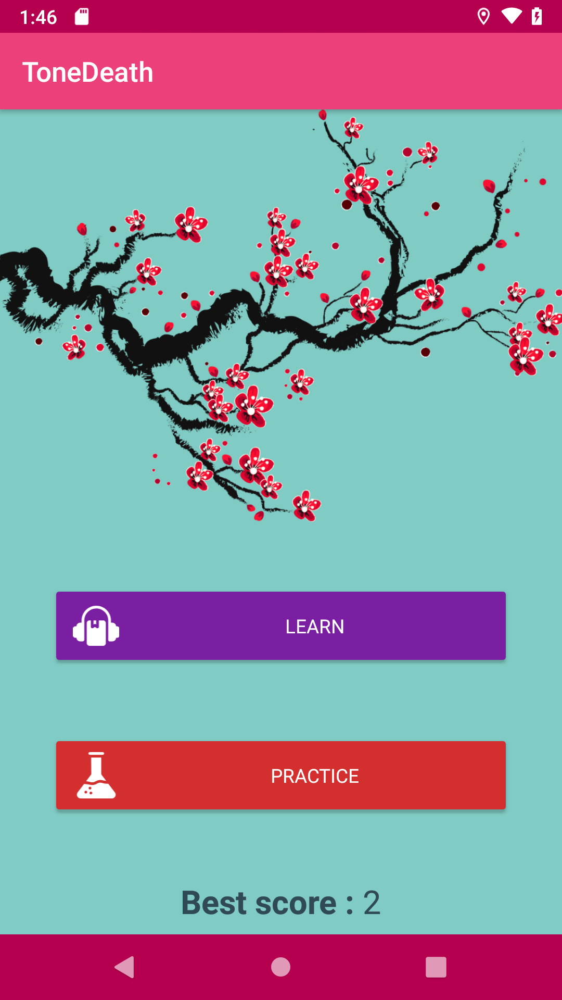
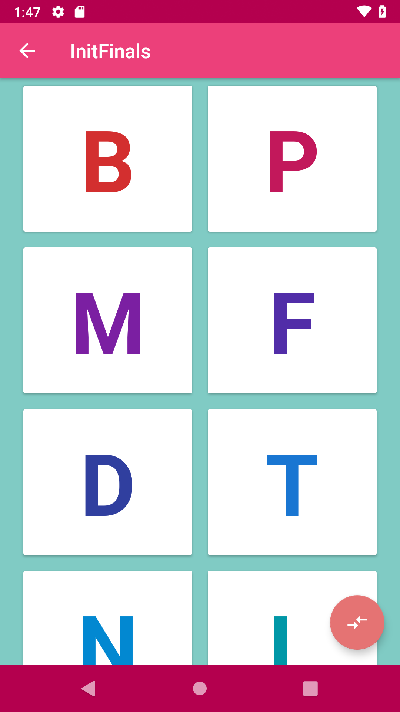
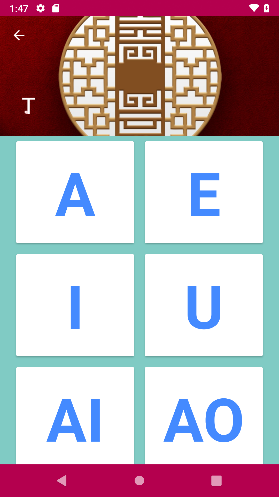
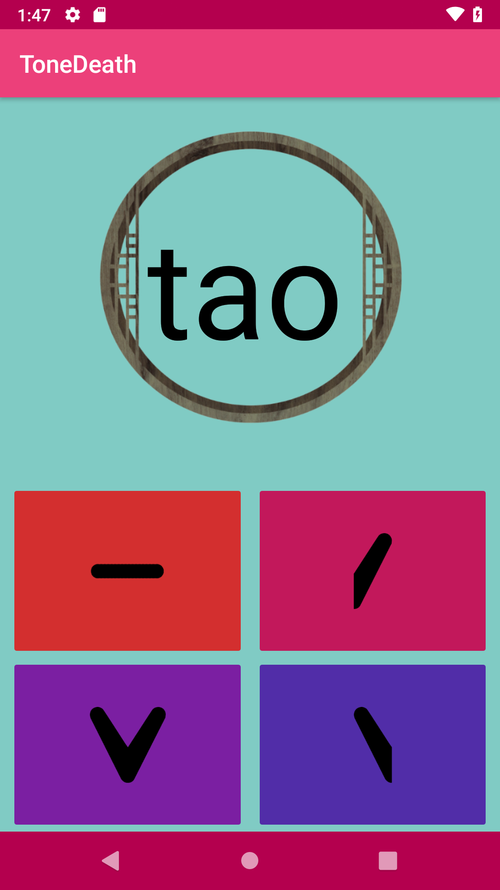

# ToneDeath [](https://www.codacy.com/project/soundlicious/ToneDeath/dashboard?utm_source=github.com&amp;utm_medium=referral&amp;utm_content=soundlicious/ToneDeath&amp;utm_campaign=Badge_Grade_Dashboard) [](https://www.udacity.com/nanodegree) [](https://github.com/soundlicious/ToneDeath/blob/master/LICENSE) []()

*“Dear laowai, we see you struggling with the Chinese (Mandarin) tones, we offer you a last chance to save your ear but in case of mistakes, be sure to bring enough coins for the afterlife!”*

*[From Fan Wujiu & Xie Bian](https://en.wikipedia.org/wiki/Heibai_Wuchang)*


**Use the help of Fan Wujiu and Xie Bian to master your listening of Chinese Mandarin tones and try to reach your best score during a practice session.**

## Compatibilities

* Android 21 or higher
* Works on mobile and tablet

## How to build

* Edit **config-template.properties** at the root of the project with you own [AdMob](https://firebase.google.com/docs/admob/android/quick-start) and [Craslytics](https://firebase.google.com/docs/crashlytics/get-started) credentials.
```
release_adMob="ca-app-pub-AdMobKey"
release_adMobRecompense="ca-app-pub-AdMobRewardKey"
release_adMobBanner="ca-app-pub-AdMobBanner"
release_fabricApiKey="FabricApiKey"
```

* Rename  **config-template.properties** to **config.properties**.
* Edit **keystore-template.properties** at the root of the project with your own keystore's credentials
```
keyAlias=yourKeyAlias
keyPassword=yourKeyPassword
storeFile=C:/your/directory/ForKeyStore.jks
storePassword=yourStorePassword
```
* Rename  **keystore-template.properties** to **keystore.properties**.
* Build Debug or Release!

## Screenshots

Main Menu            |  Learning : Main List |  Learning : Detail List
:-------------------------:|:-------------------------:|:-------------------------:
  |   |  

Learning : Listening             |  Practice |  Game Over
:-------------------------:|:-------------------------:|:-------------------------:
  |   |  

## Dependencies

Dependency          |  Description
:-------------------------:|:-------------------------:
[Constraint Layout](https://developer.android.com/reference/android/support/constraint/ConstraintLayout) | ViewGroup which allows you to position and size widgets in a flexible way
[Material Values](https://github.com/AoDevBlue/MaterialValues) | An Android library for material design values
[Butterknife](https://jakewharton.github.io/butterknife/) | Field and method binding for Android views
[SweetAlertDialog](https://github.com/thomper/sweet-alert-dialog) | Beautiful and clever alert dialog
[Room](https://developer.android.com/topic/libraries/architecture/room) |  Abstraction layer over SQLite
[Dagger 2](https://google.github.io/dagger/) | Dependencies injection
[AdMob](https://www.google.com/admob/) | Mobile app monetization
[crashlytics](http://try.crashlytics.com/) | Crash Reporter


## Todo

- [x] Record and add audio files to the project.
- [ ] Convert to Kotlin
- [ ] Replace Gradle with Koin
- [ ] Add About page and quote licences
- [ ] Change Icon
- [ ] Better Architecture and use of LiveData
- [ ] Unit Tests

## Licenses

Icons made by Freepik from www.flaticon.com, licensed by CC 3.0 BY

```
MIT License

Copyright (c) 2018 Pablo Exposito

Permission is hereby granted, free of charge, to any person obtaining a copy
of this software and associated documentation files (the "Software"), to deal
in the Software without restriction, including without limitation the rights
to use, copy, modify, merge, publish, distribute, sublicense, and/or sell
copies of the Software, and to permit persons to whom the Software is
furnished to do so, subject to the following conditions:

The above copyright notice and this permission notice shall be included in all
copies or substantial portions of the Software.

THE SOFTWARE IS PROVIDED "AS IS", WITHOUT WARRANTY OF ANY KIND, EXPRESS OR
IMPLIED, INCLUDING BUT NOT LIMITED TO THE WARRANTIES OF MERCHANTABILITY,
FITNESS FOR A PARTICULAR PURPOSE AND NONINFRINGEMENT. IN NO EVENT SHALL THE
AUTHORS OR COPYRIGHT HOLDERS BE LIABLE FOR ANY CLAIM, DAMAGES OR OTHER
LIABILITY, WHETHER IN AN ACTION OF CONTRACT, TORT OR OTHERWISE, ARISING FROM,
OUT OF OR IN CONNECTION WITH THE SOFTWARE OR THE USE OR OTHER DEALINGS IN THE
SOFTWARE.
```
